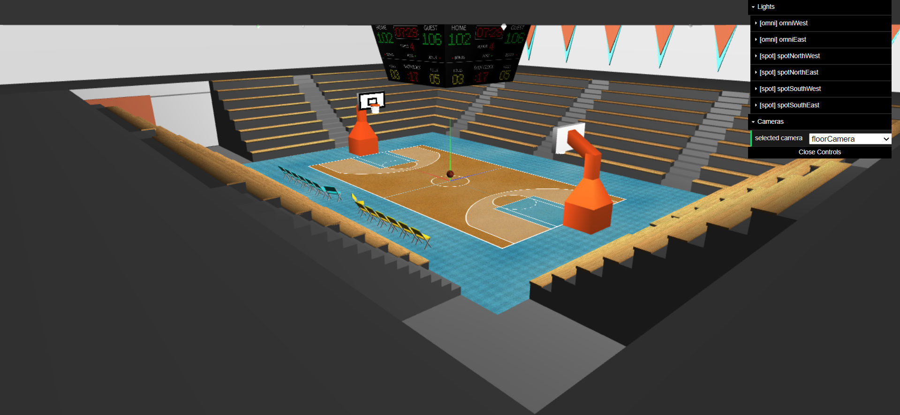
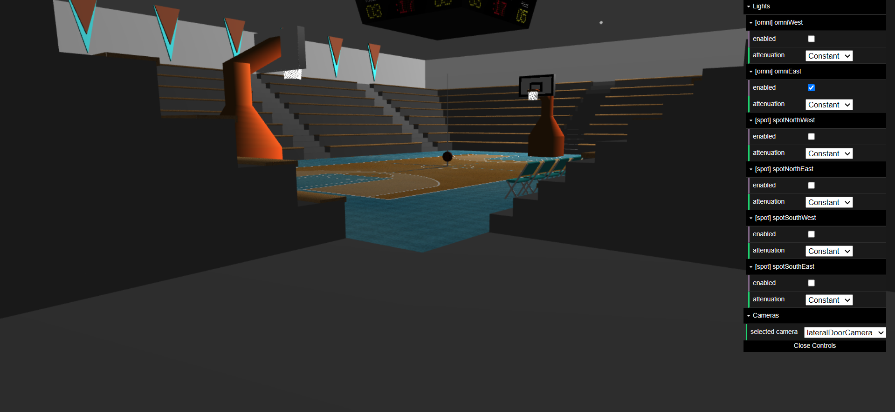

# SGI 2022/2023

## Group T04G07
| Name             | Number    | E-Mail                   |
| ---------------- | --------- | ------------------------ |
| André Pereira    | 201905650 | 201905650@edu.fe.up.pt   |
| Miguel Rodrigues | 201906042 | 201906042@edu.fe.up.pt   |

----

## Projects

### [TP1 - Scene Graph](tp1)

- All the features from the project's specification are implemented
- Extra features:
  - Changing light attenuation dinamically;
  - Multiple cameras provided to view the scene from differente angles;
  - Verified sxs error that may occur:
    - Detection and removal of cycles in the scene tree;
    - Warn user upon missing tags or required parameters;
  - Single call to update `updateTexCoords` reducing possible lag upon scene rendering;
  - Upon pressing the key `m` some materials change;

- Scene
  - Basketball Arena
  - [Scene File](./tp1/scenes/basketball.xml)

- Screeshots with different views, active lights and applied materials

-----

### [TP2 - ...](tp2)
- (items briefly describing main strong points)

----

### [TP3 - ...](tp3)
- (items briefly describing main strong points)

