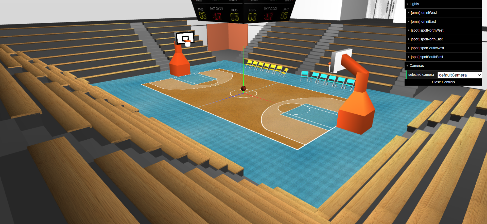
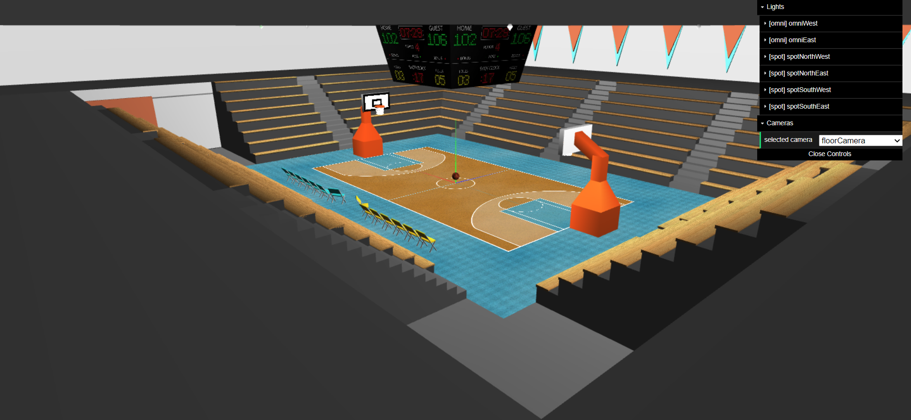
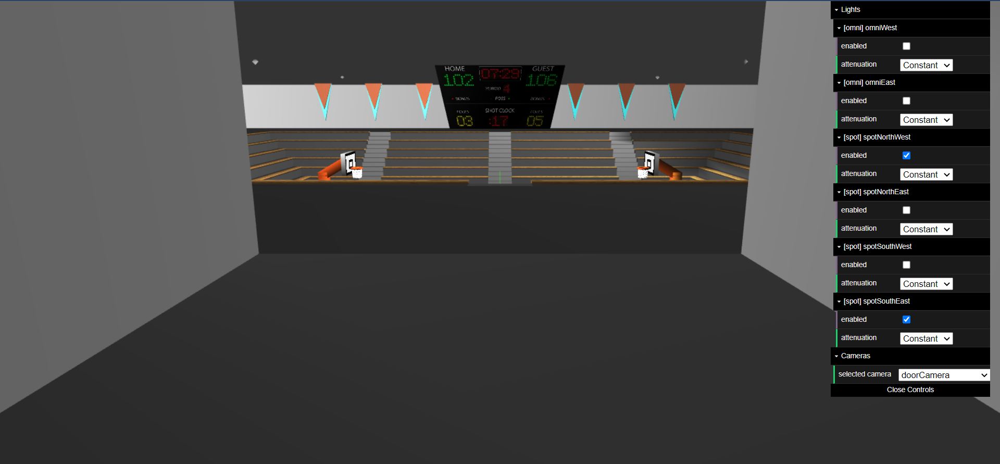
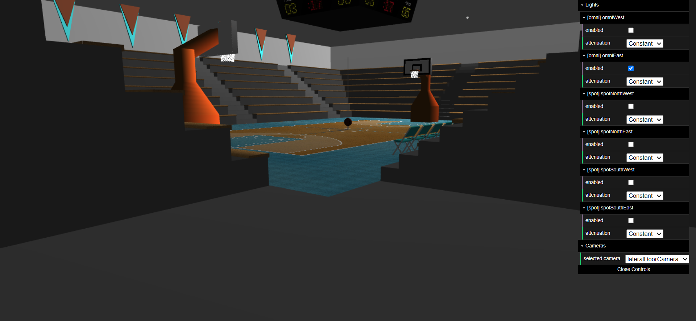
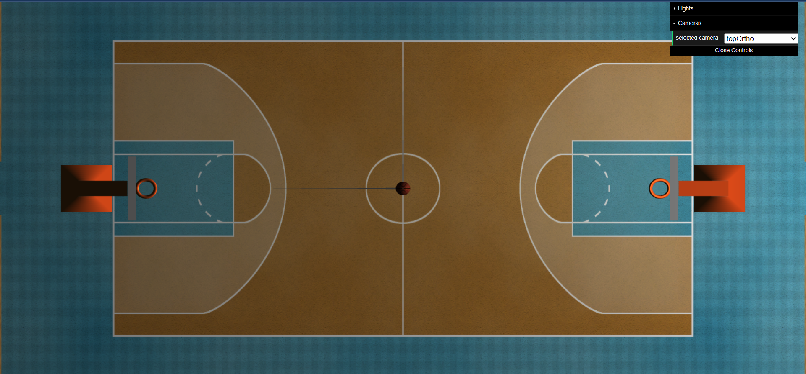
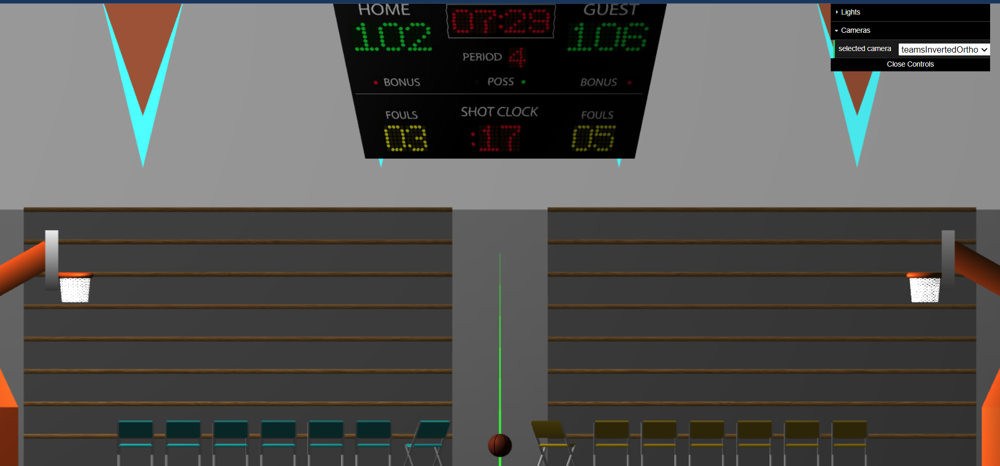
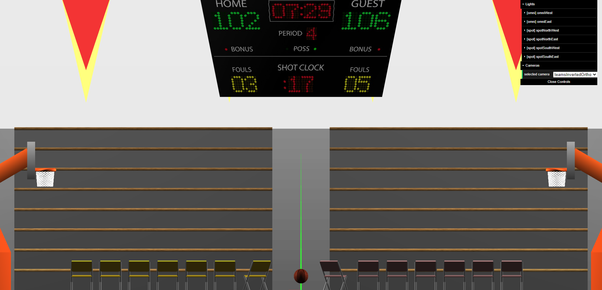

# SGI 2022/2023 - TP1

## Group: T04G07

| Name             | Number    | E-Mail                   |
| ---------------- | --------- | ------------------------ |
| André Pereira    | 201905650 | up201905650@edu.fe.up.pt |
| Miguel Rodrigues | 201906042 | up201906042@edu.fe.up.pt |

----

## Project information

- All the features from the project's specification are implemented
- Extra features:
  - Changing light attenuation dinamically;
  - Multiple cameras provided to view the scene from differente angles;
  - Verified sxs error that may occur:
    - Detection and removal of cycles in the scene tree;
    - Warn user upon missing tags or required parameters;
  - Single call to update `updateTexCoords` reducing possible lag upon scene rendering;
  - Upon pressing the key `m` some materials change;

- Scene
  - Basketball Arena
  - [Scene File](./scenes/basketball.xml)

- Screeshots with different views, active lights and applied materials

----

## Issues/Problems

- There aren't any problems that we are aware!
