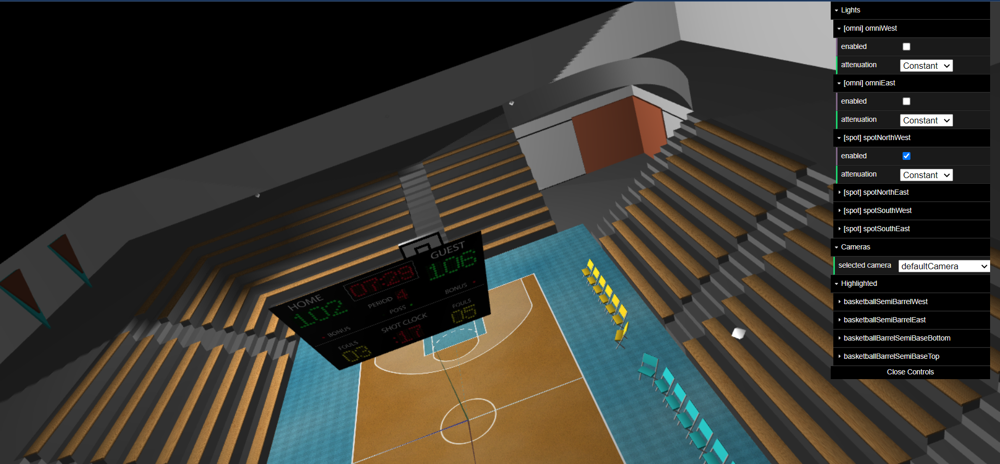
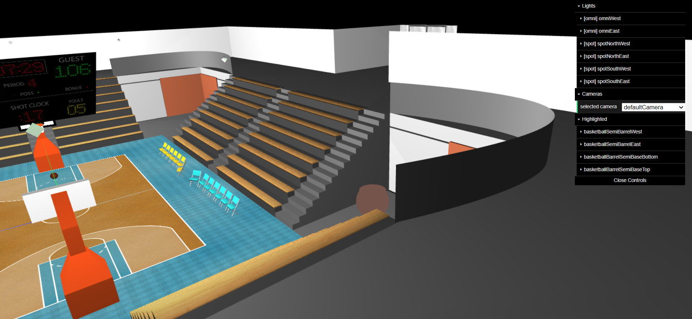
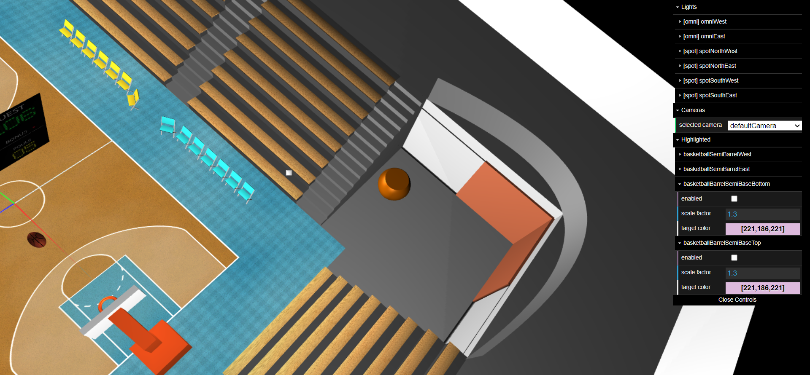
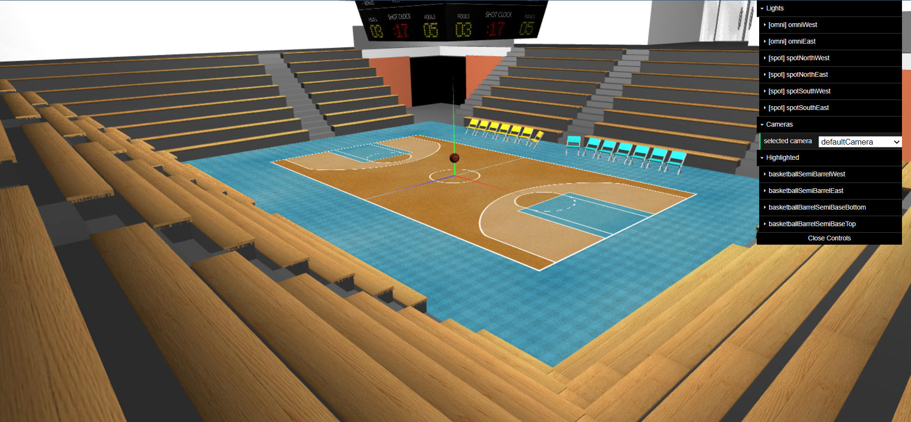
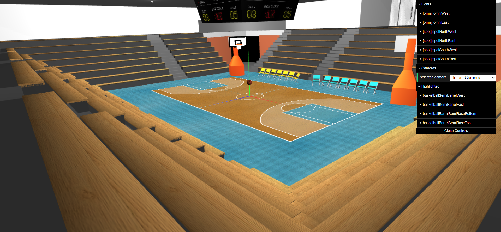
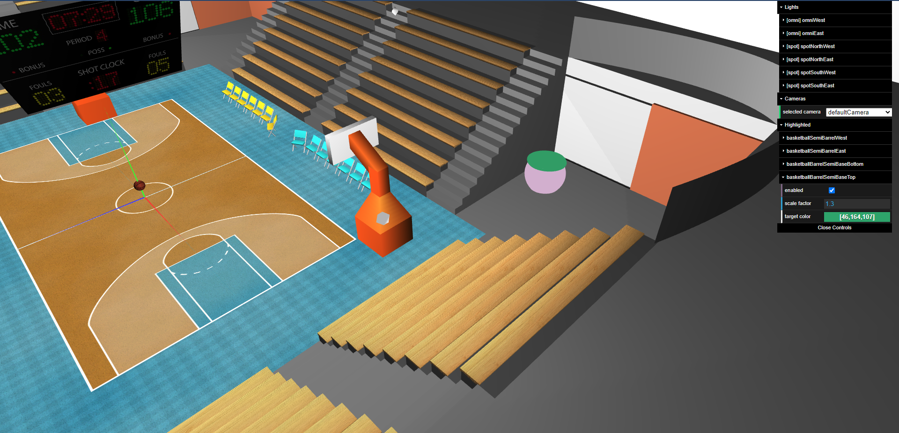
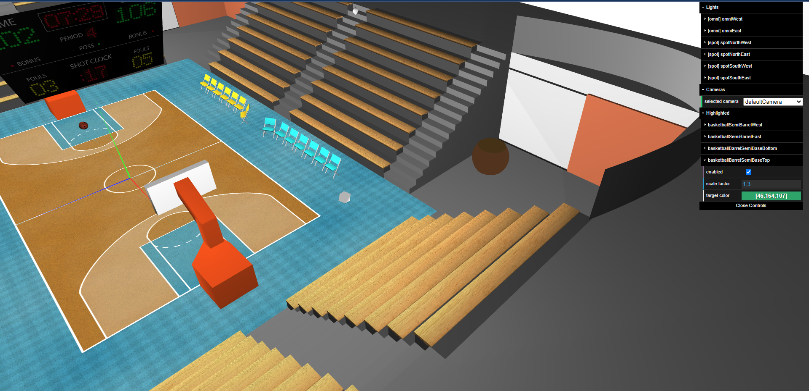
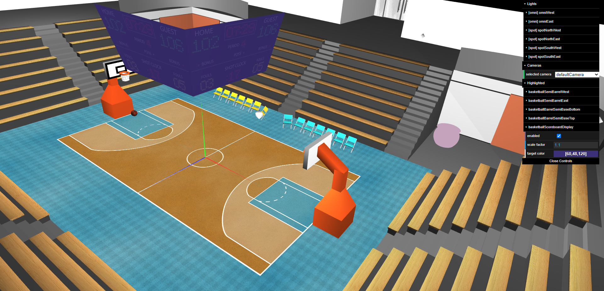

# SGI 2022/2023 - TP2

## Group: T04G07

| Name             | Number    | E-Mail                   |
| ---------------- | --------- | ------------------------ |
| André Pereira    | 201905650 | up201905650@edu.fe.up.pt |
| Miguel Rodrigues | 201906042 | up201906042@edu.fe.up.pt |

----
## Project information

- All of the required features from the project's specification are implemented
- Extra features:
  - Changed all rectangles to nurbs G1-G1 in order to have a better ilumination
  - Highlighted components can be updated dynamically
  - Animation matrix being calculated based on effective elapsed time

- Scene
  - Basketball Arena with moving hoops and ball entering net
  - [Scene File](./scenes/basketball.xml)

### Screenshots

Below there are some screenshots demonstrating different views, active lights and applied materials:

- Rectangle nurb

- Tent nurb

- Barrel nurb

- Animation

- Shaders

----

## Issues/Problems

- There aren't any problems that we are aware!